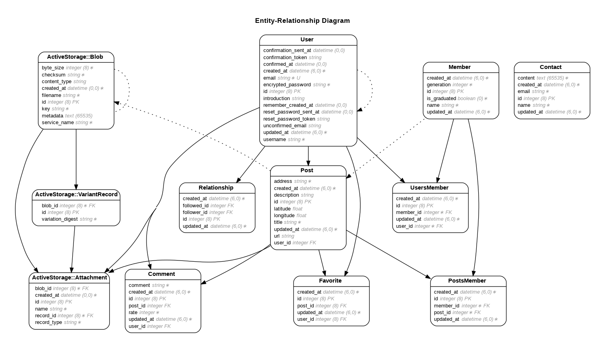

# OSHIDOKO
日向坂46の「聖地」と呼ばれる場所を共有するサービスです。
- **聖地の共有**
  - 聖地の場所を写真やコメント等とともに投稿することができます。投稿した聖地はオリジナルの地図で共有されます。
- **聖地の探索**
  - 投稿されている聖地の一覧から、指定した条件を満たす聖地を探すことができます。
- **聖地のレビュー**
  - 投稿された聖地のレビューを書くことができます。

## URL
* https://oshidoko-d1f4be94096c.herokuapp.com/

## 使い方
**＜新規登録・ログイン＞** 
投稿の閲覧のみログインなしで可能です。全ての機能をご利用の場合は、アカウントを登録してログインしてください。 
(ログイン画面にあるゲストログインを押すと、ゲストユーザーとしてアカウント登録なしでログインできます。)

**＜マップ＞** 
投稿された全ての聖地がマーカーピンで表示されます。 
マーカーピンを押すと、聖地の情報ウィンドウが表示されます。 
また、情報ウィンドウに表示される聖地名のリンクを押すと、聖地の詳細を閲覧することができます。 
聖地に関するレビューの閲覧・作成は、この詳細ページから行ってください。

聖地(投稿)詳細画面 

**＜投稿一覧＞** 
投稿された聖地が一覧で表示されます。 
キーワード検索による投稿の検索結果は、こちらの投稿一覧ページに表示されます。 
聖地の詳細を確認する場合は、マップの情報ウィンドウのときと同様に聖地名のリンクを押すか、詳細と書かれたリンクを押してください。 
ユーザーアイコンまたはユーザー名のリンクを押すことで、投稿したユーザーに関する情報を閲覧することもできます。

**＜投稿＞** 
聖地の投稿は、トップページ右下の投稿ボタンより作成できます。

## 開発背景
日向坂46には、MVや写真集・雑誌・出演TV番組の撮影地をはじめ、メンバーがブログやメッセージアプリで紹介した数多くの聖地があります。
私は推し活としてその聖地に直接訪れることもありますが、ライブ遠征や旅行のついでに「もし近くに聖地があったらちょっと行ってみようかな?」くらいの気分でふらっと立ち寄ることが多いです。

そのようなの時に聖地を調べるのですが、うまく見つけられなかったり、欲しい情報が散らばっていたりして、探すのになかなか手間取ったりしたことがあります。
「聖地の場所と関連する情報が簡単に確認できればいいのに。そうすれば推し活がもっと捗るのに。」とずっと思っていました。
おそらく同じように感じているファンの方もいると思います。

そこで「OSHIDOKO」というサービスを考えました。
「OSHIDOKO」はファンの推し活をより充実させることを目的としていますが、同時にその聖地巡礼という形の推し活が、聖地となっている地域（特に地方）の活性化にも少しでも貢献できればとも考えています。

## こだわりポイント
聖地を投稿する際、その聖地に関連するメンバーを紐づけて投稿できるようにしました。

投稿された聖地にどのメンバーが関係しているのかを確認できるため、グループの聖地としてだけでなくメンバー単位で聖地を知ることができます。
そのため、例えば推しメンと他メンバーが同じ場所を紹介していたとしても、推しが紹介していた場所(位置)をピンポイントで指定すれば、推しメンだけの聖地として共有できます。
また、推しメンの名前をキーワードにして検索することで、推しメンが関わる聖地の投稿だけを素早く見つけることもできます。

サービス名の「OSHIDOKO」という名からも想像できるように、自分の推しメンがどこを訪れたのかを簡単に確認できる、推しメンを追いやすい作りに仕上げました。

# 使用技術
* Ruby 2.7.5
* Ruby on Rails 6.1.7.3
* MySQL 8.0.33
* Docker
* CircleCI
* RSpec
* Google Maps API
* Heroku

# システム構成図

## CircleCIの流れ
1. Githubのリモートリポジトリにpushすると，RSpecとRuboCopによる静的コード解析がCircleCI上で自動実行される
2. RSpec/Rubocopともに問題がない場合，最新のコードがHeroku上にデプロイされる

# 機能一覧
* ユーザー登録機能，ログイン機能(devise)
  * アカウント認証
  * パスワード再設定
  * アカウント編集
  * プロフィール追加
  * 退会
  * ゲストログイン
* 投稿機能
  * 住所検索
  * 画像アップロード
* 投稿表示機能
  * マップ表示
  * 一覧表示
    * 投稿検索
    * ページネーション(kaminari)
* 投稿いいね機能(Ajax)
* 投稿レビュー機能(Ajax)
* ユーザーフォロー機能
* お問い合わせ機能

## ER図

# テスト
* RSpec
  * 単体テスト(Model Spec)
  * 統合テスト(System Spec)
